Raw LendersClub Analysis
========================

Load Libraries
--------------


```r
library(maps)
library(Hmisc)
```

```
## Loading required package: survival
```

```
## Loading required package: splines
```

```
## Hmisc library by Frank E Harrell Jr
## 
## Type library(help='Hmisc'), ?Overview, or ?Hmisc.Overview') to see overall
## documentation.
## 
## NOTE:Hmisc no longer redefines [.factor to drop unused levels when
## subsetting.  To get the old behavior of Hmisc type dropUnusedLevels().
```

```
## Attaching package: 'Hmisc'
```

```
## The following object(s) are masked from 'package:survival':
## 
## untangle.specials
```

```
## The following object(s) are masked from 'package:base':
## 
## format.pval, round.POSIXt, trunc.POSIXt, units
```


Download and Save data
----------------------
Donwload Data, read data in and save it to disk as RDA


```r
getwd()
```

```
## [1] "/Users/dash/Downloads/LendingClub/code/rawcode"
```

```r
download.file("https://spark-public.s3.amazonaws.com/dataanalysis/loansData.csv", 
    destfile = "../../data/loansData.csv", method = "curl")
dateDownloaded <- date()
dateDownloaded
```

```
## [1] "Sun Feb 10 13:50:09 2013"
```

```r
loansData <- read.csv("../../data/loansData.csv")
save(loansData, dateDownloaded, file = "../../data/loansData.rda")
```


### Look at the data set

```r
head(loansData)
```

```
##       Amount.Requested Amount.Funded.By.Investors Interest.Rate
## 81174            20000                      20000         8.90%
## 99592            19200                      19200        12.12%
## 80059            35000                      35000        21.98%
## 15825            10000                       9975         9.99%
## 33182            12000                      12000        11.71%
## 62403             6000                       6000        15.31%
##       Loan.Length       Loan.Purpose Debt.To.Income.Ratio State
## 81174   36 months debt_consolidation               14.90%    SC
## 99592   36 months debt_consolidation               28.36%    TX
## 80059   60 months debt_consolidation               23.81%    CA
## 15825   36 months debt_consolidation               14.30%    KS
## 33182   36 months        credit_card               18.78%    NJ
## 62403   36 months              other               20.05%    CT
##       Home.Ownership Monthly.Income FICO.Range Open.CREDIT.Lines
## 81174       MORTGAGE           6542    735-739                14
## 99592       MORTGAGE           4583    715-719                12
## 80059       MORTGAGE          11500    690-694                14
## 15825       MORTGAGE           3833    695-699                10
## 33182           RENT           3195    695-699                11
## 62403            OWN           4892    670-674                17
##       Revolving.CREDIT.Balance Inquiries.in.the.Last.6.Months
## 81174                    14272                              2
## 99592                    11140                              1
## 80059                    21977                              1
## 15825                     9346                              0
## 33182                    14469                              0
## 62403                    10391                              2
##       Employment.Length
## 81174          < 1 year
## 99592           2 years
## 80059           2 years
## 15825           5 years
## 33182           9 years
## 62403           3 years
```

```r
summary(loansData)
```

```
##  Amount.Requested Amount.Funded.By.Investors Interest.Rate 
##  Min.   : 1000    Min.   :    0              12.12% : 122  
##  1st Qu.: 6000    1st Qu.: 6000              7.90%  : 119  
##  Median :10000    Median :10000              13.11% : 115  
##  Mean   :12406    Mean   :12002              15.31% :  76  
##  3rd Qu.:17000    3rd Qu.:16000              14.09% :  72  
##  Max.   :35000    Max.   :35000              14.33% :  69  
##                                              (Other):1927  
##     Loan.Length               Loan.Purpose  Debt.To.Income.Ratio
##  36 months:1952   debt_consolidation:1307   0%     :   8        
##  60 months: 548   credit_card       : 444   12.54% :   6        
##                   other             : 201   12.20% :   5        
##                   home_improvement  : 152   12.85% :   5        
##                   major_purchase    : 101   14.22% :   5        
##                   small_business    :  87   14.66% :   5        
##                   (Other)           : 208   (Other):2466        
##      State       Home.Ownership Monthly.Income     FICO.Range  
##  CA     : 433   MORTGAGE:1148   Min.   :   588   670-674: 171  
##  NY     : 255   NONE    :   1   1st Qu.:  3500   675-679: 166  
##  TX     : 174   OTHER   :   5   Median :  5000   680-684: 157  
##  FL     : 169   OWN     : 200   Mean   :  5689   695-699: 153  
##  IL     : 101   RENT    :1146   3rd Qu.:  6800   665-669: 145  
##  GA     :  98                   Max.   :102750   690-694: 140  
##  (Other):1270                   NA's   :1        (Other):1568  
##  Open.CREDIT.Lines Revolving.CREDIT.Balance Inquiries.in.the.Last.6.Months
##  Min.   : 2.0      Min.   :     0           Min.   :0.000                 
##  1st Qu.: 7.0      1st Qu.:  5586           1st Qu.:0.000                 
##  Median : 9.0      Median : 10962           Median :0.000                 
##  Mean   :10.1      Mean   : 15245           Mean   :0.906                 
##  3rd Qu.:13.0      3rd Qu.: 18889           3rd Qu.:1.000                 
##  Max.   :38.0      Max.   :270800           Max.   :9.000                 
##  NA's   :2         NA's   :2                NA's   :2                     
##  Employment.Length
##  10+ years:653    
##  < 1 year :250    
##  2 years  :244    
##  3 years  :235    
##  5 years  :202    
##  4 years  :192    
##  (Other)  :724
```

```r
sapply(loansData[1, ], class)
```

```
##               Amount.Requested     Amount.Funded.By.Investors 
##                      "integer"                      "numeric" 
##                  Interest.Rate                    Loan.Length 
##                       "factor"                       "factor" 
##                   Loan.Purpose           Debt.To.Income.Ratio 
##                       "factor"                       "factor" 
##                          State                 Home.Ownership 
##                       "factor"                       "factor" 
##                 Monthly.Income                     FICO.Range 
##                      "numeric"                       "factor" 
##              Open.CREDIT.Lines       Revolving.CREDIT.Balance 
##                      "integer"                      "integer" 
## Inquiries.in.the.Last.6.Months              Employment.Length 
##                      "integer"                       "factor"
```


### Find out about missing values

```r
sum(is.na(loansData))
```

```
## [1] 7
```


### Remove missing value cases

```r
loansData <- loansData[complete.cases(loansData$Interest.Rate, loansData$Open.CREDIT.Lines), 
    ]
sum(is.na(loansData))
```

```
## [1] 0
```


### Make Interest Rate , Debt-to-income Ratio, loan Length numeric

```r
loansData$Interest.Rate <- as.numeric(gsub("%", "", loansData$Interest.Rate))
loansData$Debt.To.Income.Ratio <- as.numeric(gsub("%", "", loansData$Debt.To.Income.Ratio))
loansData$Loan.Length <- as.numeric(gsub("[^0-9].*", "", loansData$Loan.Length))

str(loansData$Interest.Rate)
```

```
##  num [1:2498] 8.9 12.12 21.98 9.99 11.71 ...
```


### Compute representative FICO score

```r
lowerFICO <- as.numeric(gsub("-.*", "", loansData$FICO.Range))
upperFICO <- as.numeric(gsub(".*-", "", loansData$FICO.Range))
loansData$avgFICO <- (lowerFICO + upperFICO)/2
summary(loansData$avgFICO)
```

```
##    Min. 1st Qu.  Median    Mean 3rd Qu.    Max. 
##     642     682     702     708     727     832
```


------

## Exploratory analysis

### Make some univariate plots/summaries

#### Most incomes are below 20K. There are about 2-3 outliers with exceptionally high monthly incomes

```r
hist(loansData$Monthly.Income)
```

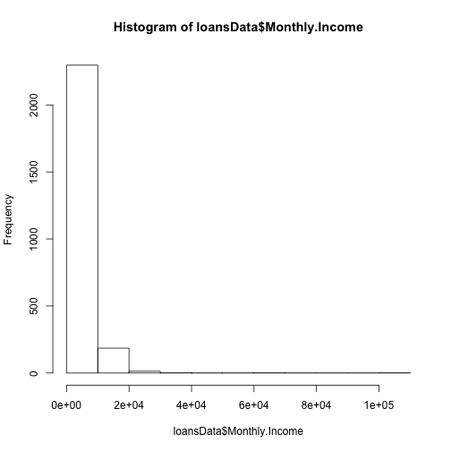 


#### Not a strong relationship between employment length and interest rate

```r
boxplot(loansData$Interest.Rate ~ loansData$Employment.Length)
```

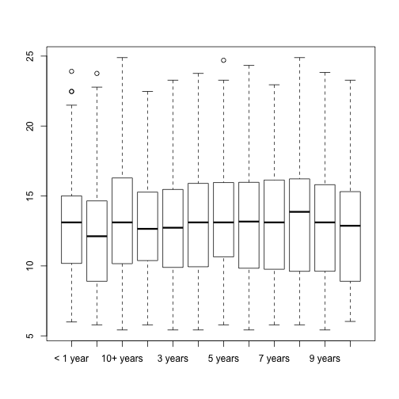 


#### Loans for Education, renewable energy seems to beget a smaller interest rate

```r
plot(loansData$Loan.Purpose, loansData$Interest.Rate, cex.axis = 0.65)
```

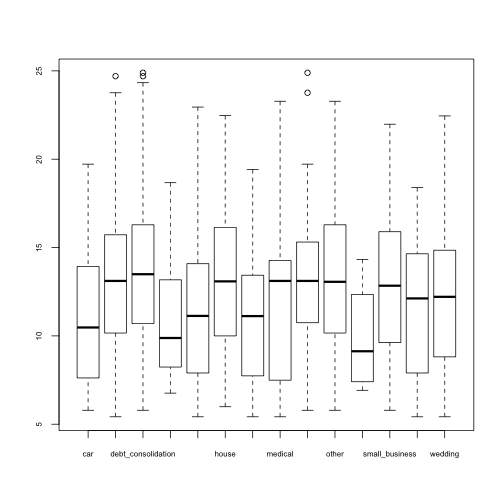 


#### Plot representative FICO Score against interest Rate

```r
plot(loansData$avgFICO, loansData$Interest.Rate)
```

 

```r
smoothScatter(loansData$avgFICO, loansData$Interest.Rate)
```

```
## KernSmooth 2.23 loaded Copyright M. P. Wand 1997-2009
```

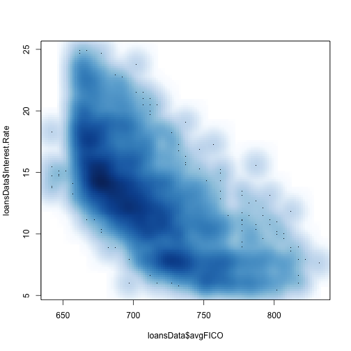 


### Let's color by salary and by amount requested
#### By Salary

```r
salCut <- cut2(loansData$Monthly.Income, g = 5)
plot(loansData$avgFICO, loansData$Interest.Rate, col = salCut)
```

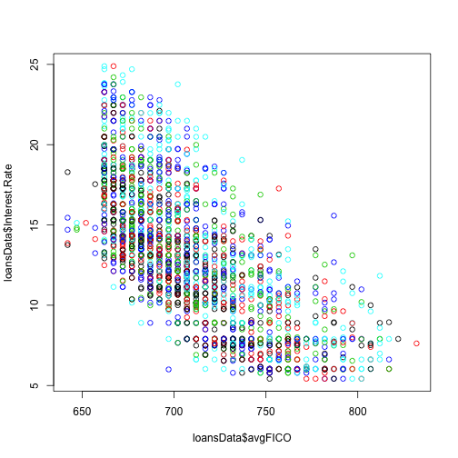 


#### By Amount

```r
amtCut <- cut2(loansData$Amount.Requested, g = 5)
plot(loansData$avgFICO, loansData$Interest.Rate, col = amtCut)
```

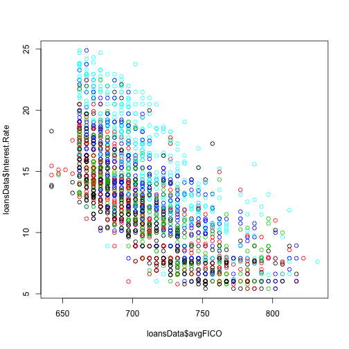 

A lot lot of light blue in the upper region


### Is there a relationship with State

```r
boxplot(loansData$Interest.Rate ~ loansData$State)
```

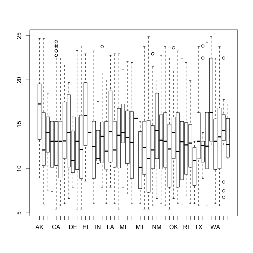 


------

## Modeling

### Fit a basic model relating representative FICO to the Interest Rate

```r
lm1 <- lm(loansData$Interest.Rate ~ loansData$avgFICO)
summary(lm1)
```

```
## 
## Call:
## lm(formula = loansData$Interest.Rate ~ loansData$avgFICO)
## 
## Residuals:
##    Min     1Q Median     3Q    Max 
## -7.990 -2.136 -0.456  1.835 10.194 
## 
## Coefficients:
##                   Estimate Std. Error t value Pr(>|t|)    
## (Intercept)       73.00811    1.19402    61.1   <2e-16 ***
## loansData$avgFICO -0.08467    0.00168   -50.3   <2e-16 ***
## ---
## Signif. codes:  0 '***' 0.001 '**' 0.01 '*' 0.05 '.' 0.1 ' ' 1 
## 
## Residual standard error: 2.95 on 2496 degrees of freedom
## Multiple R-squared: 0.503,	Adjusted R-squared: 0.503 
## F-statistic: 2.53e+03 on 1 and 2496 DF,  p-value: <2e-16
```


### Plot the regression line on the plot of FICO vs Interest Rate

```r
plot(loansData$Interest.Rate ~ loansData$avgFICO)
abline(lm1$coeff[1], lm1$coeff[2])
```

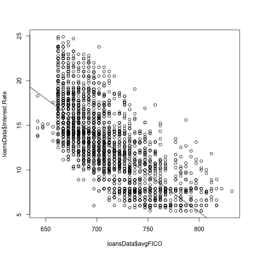 


### check residuals vs Observations, and residuls vs fitted

```r
par(mfrow = c(1, 2))
plot(loansData$avgFICO, lm1$residuals)
plot(lm1$fitted, lm1$residuals)
```

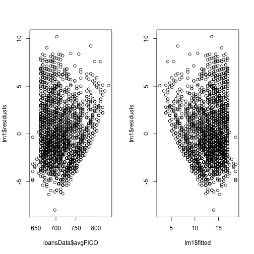 


### Lets plot them with color based on amount(see a pattern)

```r
par(mfrow = c(1, 2))
plot(loansData$avgFICO, lm1$residuals, col = amtCut)
plot(lm1$fitted, lm1$residuals, col = amtCut)
```

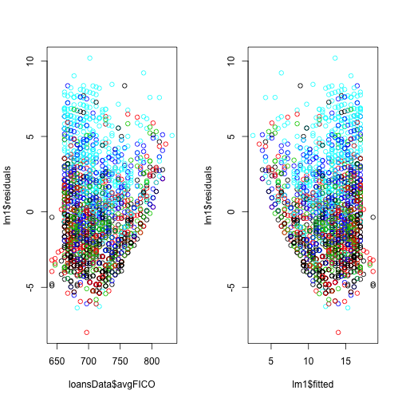 


### Lets plot them with color based on loan length(see a pattern)

```r
par(mfrow = c(1, 2))
plot(loansData$avgFICO, lm1$residuals, col = as.factor(loansData$Loan.Length))
plot(lm1$fitted, lm1$residuals, col = as.factor(loansData$Loan.Length))
```

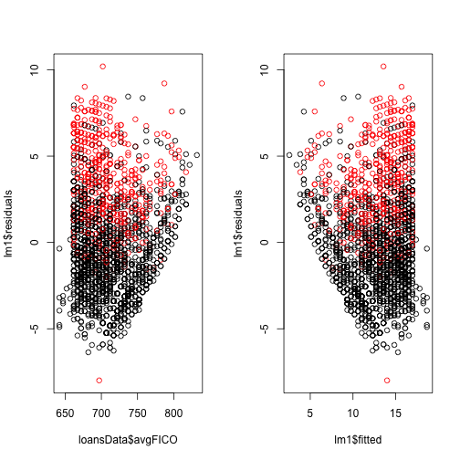 


### Let's create new model with these params

```r
lm2 <- lm(loansData$Interest.Rate ~ loansData$avgFICO + amtCut + loansData$Loan.Length)
```


### So what does this model look like:

```r
summary(lm2)
```

```
## 
## Call:
## lm(formula = loansData$Interest.Rate ~ loansData$avgFICO + amtCut + 
##     loansData$Loan.Length)
## 
## Residuals:
##     Min      1Q  Median      3Q     Max 
## -10.012  -1.472  -0.151   1.284  10.224 
## 
## Coefficients:
##                       Estimate Std. Error t value Pr(>|t|)    
## (Intercept)           68.09170    0.89316   76.24  < 2e-16 ***
## loansData$avgFICO     -0.08735    0.00123  -71.24  < 2e-16 ***
## amtCut[ 5500, 9050)    0.34132    0.13504    2.53  0.01155 *  
## amtCut[ 9050,12100)    0.48815    0.13528    3.61  0.00031 ***
## amtCut[12100,19400)    1.30252    0.13781    9.45  < 2e-16 ***
## amtCut[19400,35000]    2.82968    0.14459   19.57  < 2e-16 ***
## loansData$Loan.Length  0.14102    0.00471   29.96  < 2e-16 ***
## ---
## Signif. codes:  0 '***' 0.001 '**' 0.01 '*' 0.05 '.' 0.1 ' ' 1 
## 
## Residual standard error: 2.14 on 2491 degrees of freedom
## Multiple R-squared: 0.739,	Adjusted R-squared: 0.738 
## F-statistic: 1.18e+03 on 6 and 2491 DF,  p-value: <2e-16
```

```r
confint(lm2)
```

```
##                          2.5 %   97.5 %
## (Intercept)           66.34029 69.84310
## loansData$avgFICO     -0.08975 -0.08494
## amtCut[ 5500, 9050)    0.07653  0.60612
## amtCut[ 9050,12100)    0.22287  0.75343
## amtCut[12100,19400)    1.03228  1.57275
## amtCut[19400,35000]    2.54615  3.11321
## loansData$Loan.Length  0.13179  0.15025
```


lm2 <- lm(loansData$Interest.Rate ~ loansData$avgFICO + loansData$Loan.Length + loansData$Amount.Requested + log(loansData$Monthly.Income+1)  + loansData$Amount.Requested)
